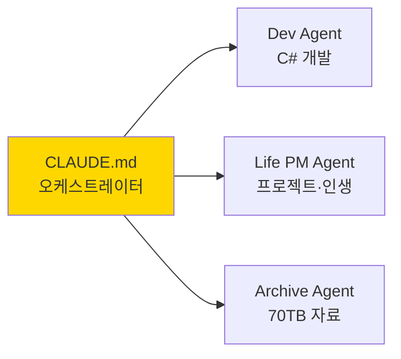

# CLAUDE.md — 하네스 오케스트레이터

> **이 파일은 최상위 진입점입니다.**
> Claude Code가 가장 먼저 읽고, 필요에 따라 아래 문서를 추가로 로드합니다.

**Owner**: [이름]
**Created**: 2026-04-24
**Version**: 0.1

---

## 📑 빠른 네비게이션

클릭하면 해당 문서가 열립니다.

| 문서 | 내용 | 언제 읽나 |
|---|---|---|
| [🗺️ 전체 구조](./docs/01-structure.md) | 하네스 폴더·에이전트 구조도 | 새 작업 시작 시 |
| [🔀 작업 분기 규칙](./docs/02-routing.md) | 어떤 에이전트로 라우팅할지 | 매 요청마다 |
| [🔒 절대 규칙](./docs/03-rules.md) | 보호 파일, 금지 사항 | 매 요청마다 |
| [🔁 검증 절차](./docs/04-feedback-loop.md) | 작업 완료 후 자동 검증 | 작업 완료 시 |
| [🚀 로드맵](./docs/05-roadmap.md) | 하네스 구축 일정 | 주간 리뷰 시 |

---

## ⚡ 매 요청 시 필수 절차

1. **[03-rules.md](./docs/03-rules.md)** 읽고 금지·보호 조항 확인
2. **[02-routing.md](./docs/02-routing.md)** 로 해당 서브에이전트 판단
3. 작업 수행
4. **[04-feedback-loop.md](./docs/04-feedback-loop.md)** 로 검증
5. 결과 보고

---

## 🧭 도메인 요약

상세 구조는 → [🗺️ 전체 구조](./docs/01-structure.md)

---

## 📝 변경 이력

| 날짜 | 버전 | 변경 내용 |
|---|---|---|
| 2026-04-24 | 0.1 | 최초 작성 (분리 파일 구조) |
