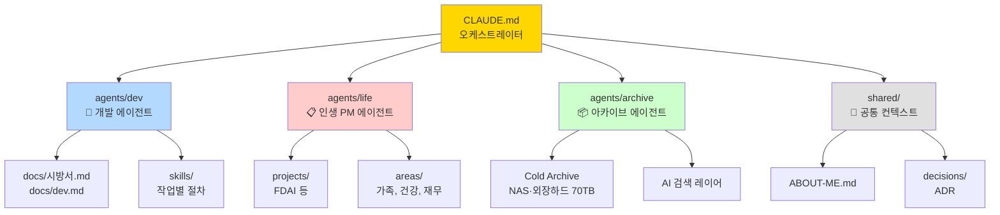

# 🗺️ 01. 전체 구조

> 하네스의 폴더·에이전트 전체 지도.
> **돌아가기**: [← CLAUDE.md](../CLAUDE.md)

---

## 계층 트리



---

## 폴더 구조 (텍스트)

```
C:\Claude\YJWOO Life\   ← Obsidian Vault = 하네스 루트
├── CLAUDE.md                    ← 오케스트레이터 (진입점)
│
├── docs/                        ← 오케스트레이터 문서
│   ├── 01-structure.md          ← 이 파일
│   ├── 02-routing.md
│   ├── 03-rules.md
│   ├── 04-feedback-loop.md
│   └── 05-roadmap.md
│
├── shared/                      ← 모든 에이전트 공유
│   ├── ABOUT-ME.md              ← 사용자 정체성
│   ├── decisions/               ← 주요 결정 (ADR)
│   ├── proposals/               ← 변경 제안
│   └── conversations/           ← 대화 로그
│
├── agents/
│   ├── dev/
│   │   ├── CLAUDE.md            ← 개발 에이전트 규칙
│   │   ├── skills/              ← 작업별 절차
│   │   └── projects/
│   │
│   ├── life/
│   │   ├── CLAUDE.md            ← 인생 PM 에이전트 규칙
│   │   ├── projects/            ← FDAI (상세 미정) 등
│   │   └── areas/               ← 가족/건강/재무
│   │
│   └── archive/
│       ├── CLAUDE.md            ← 아카이브 에이전트 규칙
│       └── inventory/           ← 자료 목록
│
├── 📁 Projects/                 ← Obsidian PARA: 진행 중 프로젝트
├── 📚 Areas/                    ← Obsidian PARA: 책임 영역
├── 📥 Inbox/                    ← 날것 입력 (폰에서)
├── 🗃️ Resources/               ← 참조 자료
├── 🗄️ Archive/                 ← 완료된 항목
└── 🖼️ Attachments/             ← 이미지·첨부파일
```

---

## 에이전트별 역할

| 에이전트 | 담당 | 주요 파일 |
|---|---|---|
| **🔧 Dev** | C# 코드 작성·수정·테스트·빌드 | `src/`, `tests/`, `docs/시방서.md` |
| **📋 Life PM** | 프로젝트 관리, 일정, 인생 결정 | `agents/life/projects/`, `agents/life/areas/` |
| **📦 Archive** | 70TB 자료 정리, 백업, 검색 | `agents/archive/inventory/` |

---

## Obsidian PARA ↔ 하네스 매핑

| Obsidian PARA 폴더 | 하네스 매핑 |
|---|---|
| 📁 Projects | `agents/life/projects/` 의 활성 프로젝트 |
| 📚 Areas | `agents/life/areas/` 의 책임 영역 |
| 📥 Inbox | 날것 메모, 빠른 캡처 |
| 🗃️ Resources | 참조 자료, 학습 노트 |
| 🗄️ Archive | 완료·보관 항목 |

---

## ❓ 미정 항목

- **FDAI**: 이름만 있음. 설명 추가 후 `agents/life/projects/fdai/` 생성 예정

---

## 관련 문서

- [🔀 02. 작업 분기 규칙](./02-routing.md)
- [🔒 03. 절대 규칙](./03-rules.md)
