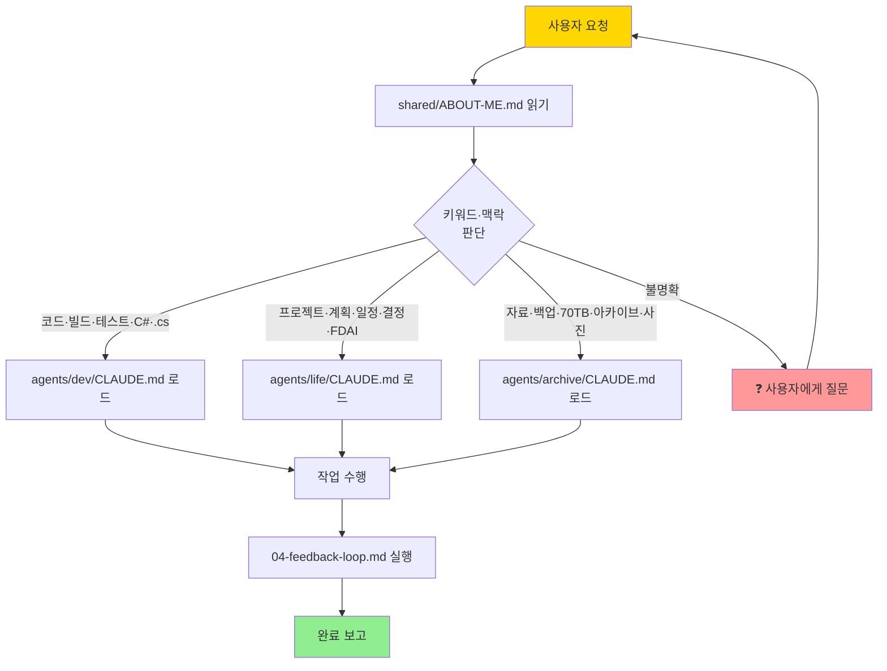
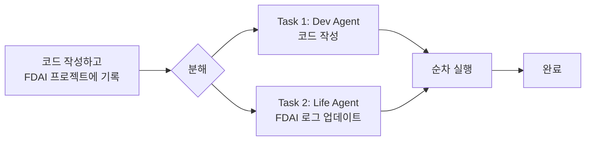

# 🔀 02. 작업 분기 규칙

> 사용자 요청이 들어왔을 때 **어떤 서브에이전트로 라우팅할지** 결정하는 규칙.
> **돌아가기**: [← CLAUDE.md](../CLAUDE.md)

---

## 판단 플로우

---

## 명시적 분기 조건

| 키워드·맥락 | 로드할 에이전트 |
|---|---|
| "코드", "빌드", "테스트", "C#", ".cs", "리팩토링", "버그" | `agents/dev/CLAUDE.md` |
| "프로젝트", "계획", "일정", "결정", "FDAI", "인생", "PM" | `agents/life/CLAUDE.md` |
| "자료", "백업", "70TB", "아카이브", "사진", "NAS", "외장하드" | `agents/archive/CLAUDE.md` |
| **위 어디에도 해당 없음** | **❓ 반드시 사용자에게 질문** |

---

## 🚨 핵심 원칙

> **Claude는 스스로 판단하지 않는다.**
>
> 위 조건에 **명확히 해당하지 않으면 추측 금지**, 사용자에게 질문해야 함.

---

## 멀티 도메인 요청 처리

요청이 두 도메인 이상 걸칠 때:

원칙:
1. 요청을 **독립적인 하위 작업**으로 분해
2. 각 작업을 **해당 에이전트로 개별 라우팅**
3. 순차 실행 (병렬 실행은 아직 지원 안 함)

---

## 예시

| 사용자 요청 | 라우팅 |
|---|---|
| "로그인 기능 C#으로 짜줘" | Dev |
| "이번 주 할 일 정리" | Life |
| "2015년 사진 찾아줘" | Archive |
| "FDAI 프로젝트 시작" | Life (단, 설명 먼저 요청) |
| "뭐 할까?" | ❓ 사용자에게 질문 |

---

## 관련 문서

- [🗺️ 01. 전체 구조](./01-structure.md)
- [🔒 03. 절대 규칙](./03-rules.md)
- [🔁 04. 검증 절차](./04-feedback-loop.md)
