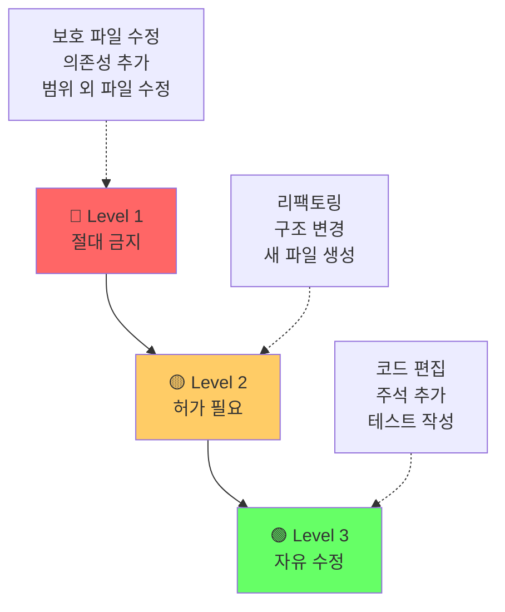
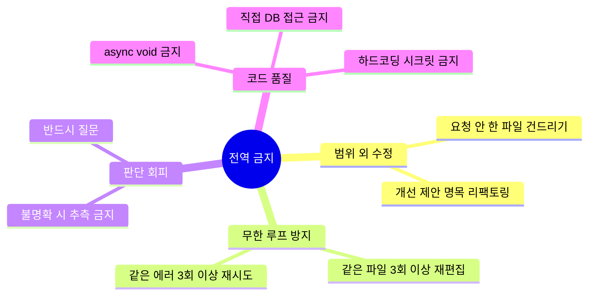
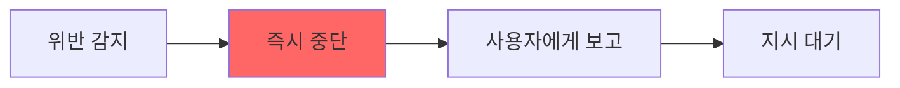

# 🔒 03. 절대 규칙

> 위반 시 **즉시 중단**. 모든 에이전트에 공통 적용.
> **돌아가기**: [← CLAUDE.md](../CLAUDE.md)

---

## 규칙 위계



---

## 🔴 Level 1 — 보호 파일 (수정·삭제 절대 금지)

```
CLAUDE.md                    ← 최상위 진입점
docs/01-structure.md
docs/02-routing.md
docs/03-rules.md              ← 이 파일
docs/04-feedback-loop.md
docs/05-roadmap.md
shared/ABOUT-ME.md
shared/decisions/**
docs/시방서.md
docs/dev.md
```

**변경이 필요하면**:
1. **반드시 사용자에게 먼저 질문**
2. 변경 제안은 `shared/proposals/YYYY-MM-DD-주제.md`에 별도 작성
3. 사용자 승인 후에만 원본 수정

---

## 🟡 Level 2 — 허가 필요

- 새 NuGet 패키지·의존성 추가
- 기존 클래스·인터페이스 시그니처 변경
- 아키텍처 레이어 추가·삭제
- 데이터베이스 스키마 변경
- 파일·폴더 이름 변경

**절차**: 제안 → 사용자 확인 → 실행

---

## 🟢 Level 3 — 편집 가능 (자유)

```
src/**                        ← C# 코드
tests/**                      ← 테스트
agents/**/skills/**           ← 서브에이전트 스킬
agents/**/projects/**         ← 프로젝트별 작업 문서
📥 Inbox/**                   ← 날것 입력
shared/proposals/**           ← 변경 제안
```

---

## ⛔ 전역 금지 사항



---

## 🚨 위반 감지 시 대응



**보고 포맷**:
```
⚠️ 규칙 위반 감지
- 위반 항목: [Level X - 항목명]
- 상황: [무엇을 하려 했는지]
- 중단 시점: [어디서 멈췄는지]
- 필요 지시: [사용자가 결정해야 할 것]
```

---

## 관련 문서

- [🔀 02. 작업 분기 규칙](./02-routing.md)
- [🔁 04. 검증 절차](./04-feedback-loop.md)
