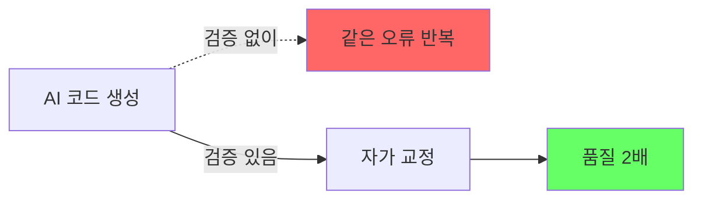
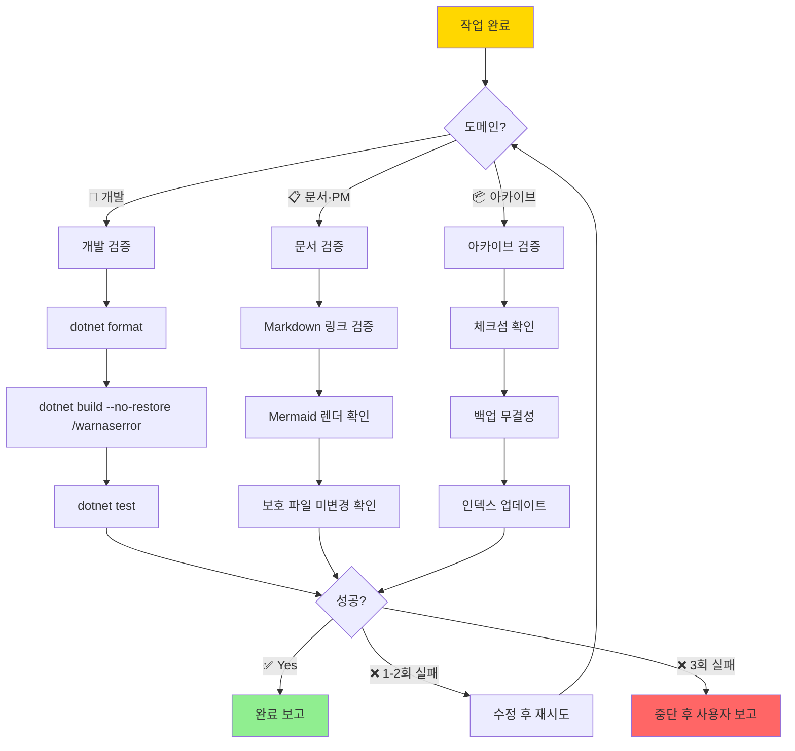

# 🔁 04. 검증 절차 (Feedback Loop)

> 작업 완료 후 **자동 검증**. 하네스의 가장 중요한 레버.
> **돌아가기**: [← CLAUDE.md](../CLAUDE.md)

---

## 왜 Feedback Loop인가



**핵심**: 에이전트가 **자기 결과를 스스로 검증**하게 만들어야 품질이 나온다.

---

## 도메인별 검증 플로우



---

## 🔧 개발 (Dev Agent) 검증 커맨드

```bash
# 1. 포맷 정리
dotnet format

# 2. 경고를 에러로 취급하여 빌드
dotnet build --no-restore /warnaserror

# 3. 전체 테스트
dotnet test
```

**실패 시 규칙**:
- **1-2회**: 자동 수정 후 재시도
- **3회 이상**: 중단, 사용자에게 보고

---

## 📋 문서·PM (Life Agent) 검증

| 항목 | 방법 |
|---|---|
| 링크 유효성 | 모든 `[[wikilink]]`, `./relative/path.md` 타겟 존재 확인 |
| Mermaid 문법 | 코드블록 파싱 성공 확인 |
| 보호 파일 | `03-rules.md`의 Level 1 파일 미변경 확인 |
| Frontmatter | YAML 문법 유효성 |

---

## 📦 아카이브 (Archive Agent) 검증

| 항목 | 방법 |
|---|---|
| 체크섬 | `sha256sum` 기록·비교 |
| 백업 무결성 | 3-2-1 규칙 (3 복사본, 2 매체, 1 외부) |
| 인덱스 동기화 | `inventory/index.md` 갱신 |

---

## 완료 보고 포맷

```markdown
## ✅ 작업 완료

**수행 내용**: [간단 요약]

**검증 결과**:
- [x] dotnet format
- [x] dotnet build (0 errors, 0 warnings)
- [x] dotnet test (125 passed, 0 failed)

**변경 파일**:
- src/Auth/LoginService.cs
- tests/Auth/LoginServiceTests.cs

**다음 단계 제안**: [선택 사항]
```

---

## 실패 보고 포맷

```markdown
## ⚠️ 작업 중단

**시도 내용**: [무엇을 하려 했는지]

**실패 지점**: [검증 몇 번째에서 멈췄는지]

**시도 횟수**: 3회

**에러 로그**:
\`\`\`
[핵심 에러 메시지]
\`\`\`

**필요 지시**: [사용자가 결정해야 할 것]
```

---

## 관련 문서

- [🔒 03. 절대 규칙](./03-rules.md)
- [🚀 05. 로드맵](./05-roadmap.md)
