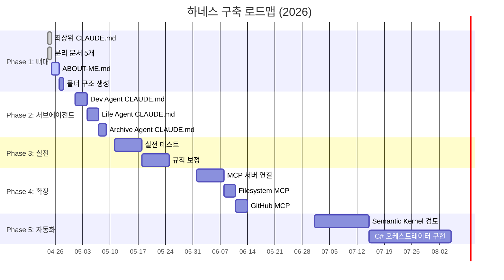
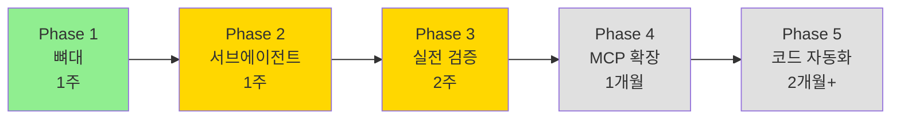

# 🚀 05. 로드맵

> 하네스 구축 장기 계획.
> **돌아가기**: [← CLAUDE.md](../CLAUDE.md)

---

## 전체 일정 (간트 차트)

---

## 단계별 목표

---

## Phase별 상세

### Phase 1 — 뼈대 (4/24 ~ 4/30)

**목표**: 파일만으로 돌아가는 최소 하네스

- [x] CLAUDE.md (최상위)
- [x] docs/01~05 분리 문서
- [ ] shared/ABOUT-ME.md
- [ ] 실제 폴더 구조 생성

**완료 기준**: Claude Code가 CLAUDE.md만 읽고 작업 분기 가능

---

### Phase 2 — 서브에이전트 (5/1 ~ 5/10)

**목표**: 3개 도메인 에이전트 규칙화

- [ ] `agents/dev/CLAUDE.md` — 기존 시방서·dev.md 연결
- [ ] `agents/life/CLAUDE.md` — FDAI 등 프로젝트 정의
- [ ] `agents/archive/CLAUDE.md` — 70TB 인벤토리 전략

**완료 기준**: 각 에이전트가 독립 작업 가능

---

### Phase 3 — 실전 검증 (5/11 ~ 5/24)

**목표**: 실제 작업으로 규칙 검증·보정

- [ ] 실제 C# 작업 1개 통과
- [ ] 프로젝트 관리 작업 1개 통과
- [ ] 자료 검색 작업 1개 통과
- [ ] 빠진 규칙 추가

**완료 기준**: 컨텍스트 드리프트 없음, 리밋 초과 없음

---

### Phase 4 — MCP 확장 (6월)

**목표**: 외부 도구 연결

- [ ] Filesystem MCP (로컬 파일 직접 접근)
- [ ] GitHub MCP (커밋·PR 자동화)
- [ ] (선택) DB MCP, Jira MCP

---

### Phase 5 — 코드 자동화 (7월+)

**목표**: C# 오케스트레이터 구현

- [ ] Semantic Kernel 학습
- [ ] 플러그인 기반 서브에이전트
- [ ] Claude API 연결
- [ ] .NET 네이티브 운영

---

## 마일스톤 체크포인트

| 시점 | 체크 항목 |
|---|---|
| 4/30 | 파일 기반 하네스 완성 |
| 5/10 | 3개 에이전트 가동 |
| 5/24 | 실전 검증 완료 |
| 6/30 | MCP 2개 이상 연결 |
| 8/31 | Semantic Kernel 전환 여부 결정 |

---

## 관련 문서

- [🗺️ 01. 전체 구조](./01-structure.md)
- [🔁 04. 검증 절차](./04-feedback-loop.md)
