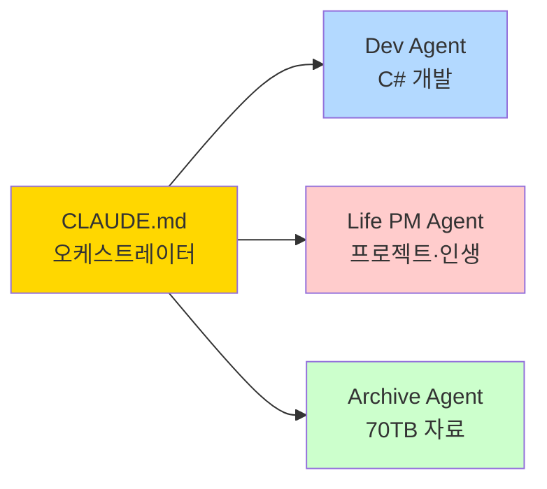

# 👤 ABOUT-ME — 사용자 정체성 파일

> 모든 에이전트가 **가장 먼저** 읽는 파일.
> Claude가 나를 이해하기 위한 컨텍스트 전체.
> **이 파일을 읽으면 내가 누구인지, 무엇을 원하는지 알 수 있어야 한다.**

---

## 🪪 기본 정보

| 항목 | 내용 |
|---|---|
| **이름** | [이름] |
| **Vault 이름** | YJWOO Life |
| **거주지** | 경기도 화성시 |
| **직업** | 개발자 (C#) |
| **주요 언어** | 한국어 (소통), C# (개발) |

---

## 🧠 나는 이런 사람이다

```
[자유 서술 — 예시]
나는 40년치 자료를 정리하면서 인생 전체를 시스템으로 관리하고 싶은 사람이다.
코드보다 차트로 이해하는 편이며, 텍스트보다 Mermaid 다이어그램을 선호한다.
큰 그림을 먼저 보고, 세부는 필요할 때만 파고든다.
```

---

## 💼 현재 역할 & 책임

### 직업
- **직종**: C# 개발자
- **사용 기술**: C#, .NET, [추가 기술 스택]
- **현재 프로젝트**: [프로젝트명]
- **주요 도구**: Visual Studio / Rider, Git, [기타]

### 인생 프로젝트
- **FDAI**: [설명 필요 — 무엇의 약자인지, 어떤 프로젝트인지]
- [추가 프로젝트]

---

## 🎯 장기 목표

```
[자유 서술 — 예시]
1. 70TB 자료를 AI로 검색 가능하게 정리한다
2. C# 오케스트레이터로 하네스를 완전 자동화한다
3. Obsidian + Claude Code로 인생 전체를 관리한다
```

---

## 🗂️ 자료 현황 (70TB 아카이브)

| 분류 | 규모 | 위치 | 상태 |
|---|---|---|---|
| 사진·영상 | [규모] | NAS / 외장하드 | 미정리 |
| 문서·자료 | [규모] | [위치] | 미정리 |
| 코드·프로젝트 | [규모] | [위치] | [상태] |
| [기타] | [규모] | [위치] | [상태] |

**정리 목표**: AI 검색 레이어 구축 → 즉시 검색 가능

---

## 🧩 선호 작업 방식

### 커뮤니케이션
- **시각화 선호**: Mermaid 차트, 간트, 마인드맵 우선
- **텍스트 분량**: 핵심만 짧게. 장황한 설명 불필요
- **언어**: 한국어로 소통, 코드·용어는 영어 그대로

### 코드 작업
- **언어**: C# 우선
- **스타일**: [코딩 스타일 — 예: 함수형, 계층형 등]
- **금지 패턴**: `async void`, 직접 DB 접근, 하드코딩 시크릿
- **빌드 기준**: `dotnet build /warnaserror` 통과 필수

### 의사결정
- **속도**: 큰 결정은 숙고, 작은 결정은 빠르게
- **정보 형식**: 선택지 2~3개 제시 → 내가 고른다
- **Claude 역할**: 판단하지 말고 옵션을 제시할 것

---

## 🏠 생활 영역 (Areas)

| 영역 | 현황 | 메모 |
|---|---|---|
| **가족** | [현황] | |
| **건강** | [현황] | |
| **재무** | [현황] | |
| **집·공간** | [현황] | 집수리 프로젝트 있음 |
| **학습** | [현황] | |

---

## 🔧 사용 도구 스택

| 분류 | 도구 |
|---|---|
| **메모·지식** | Obsidian (`C:\Claude\YJWOO Life`) |
| **AI 코딩** | Claude Code |
| **AI 소통** | Claude.ai |
| **개발** | C#, .NET, Visual Studio |
| **버전 관리** | Git |
| **NAS·백업** | [NAS 모델 / 백업 솔루션] |
| **기타** | [추가] |

---

## 📁 하네스 구조 요약



- **Vault 위치**: `C:\Claude\YJWOO Life`
- **하네스 진입점**: `CLAUDE.md`
- **에이전트 규칙**: `agents/*/CLAUDE.md`
- **대화 로그**: `shared/conversations/YYYY/MM/`

---

## ⚠️ Claude에게 당부하는 것

```
1. 불명확하면 추측하지 말고 반드시 질문할 것
2. 차트·다이어그램으로 시각화할 수 있으면 항상 할 것
3. 보호 파일(docs/03-rules.md Level 1 목록)은 절대 수정하지 말 것
4. 작업 완료 후 반드시 04-feedback-loop.md 검증 실행
5. 선택지는 2~3개, 내가 고르게 할 것. 혼자 결정하지 말 것
```

---

## 📝 변경 이력

| 날짜 | 변경 내용 |
|---|---|
| 2026-04-24 | 최초 작성 (초안) |
